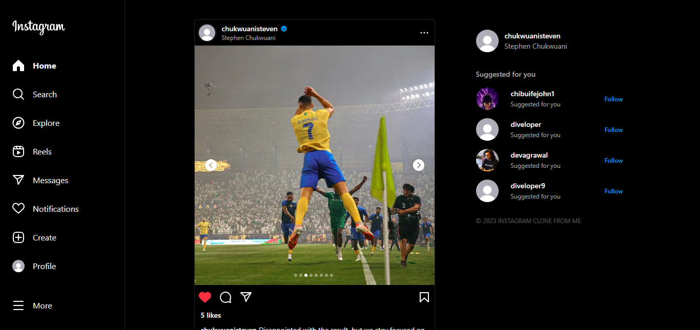

# [Instagram clone](https://instaglone.vercel.app/)

A clone of the popular Instagram web application UI. Built with Nextjs, Tailwindcss and Firebase.

> **Warning**
> This project is still in development.

## Features
- [x]  Authentication with Clerk
- [x]  Light/dark mode toggle
- [x]  Responsive design
- [x]  Create, like, and save post
- [x]  Explore page
- [x]  User Profile
- [x]  Suggested Users
- [x]  Follow and Unfollow
- [ ]  Edit, Delete, Comment on post
- [ ]  Messaging
- [ ]  Notification
- [ ]  Post detail page


## Tech Stack

- **Framework:** [Next.js](https://nextjs.org)
- **Styling:** [Tailwind CSS](https://tailwindcss.com)
- **User Management:** [Clerk](https://clerk.com)
- **UI Components:** [shadcn/ui](https://ui.shadcn.com)
- **Backend:** [Firebase](https://firebase.com)


## Run Locally

Clone the project

```bash
  git clone https://github.com/chukwuani/instaclone
```

Go to the project directory

```bash
  cd instaclone
```

Install dependencies

```bash
  npm install
```

Start the development server

```bash
  npm run dev
```
